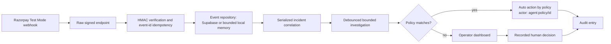

# PayScope — Implementation Status and Continuation Plan

**Last audited:** 2026-08-21  
**Current state:** locally verified Razorpay Test Mode MVP in a **single repo** (`backend/` + `frontend/`); deploy via Vercel. Legacy Intent Canvas code lives in separate repos (`intent-canvas-backend` etc.) and is not referenced here. Not yet externally deployed.  
**Safe product boundary (updated 2026-08-21 — autonomy):** PayScope observes payment operations, explains evidence, and by default records a human decision. An admin may now configure **autonomy policies** (thresholds for incident type, severity, confidence, amount) so the agent auto-executes *safe* non-financial actions (`monitor`, `prepare_follow_up`, `review_payment_method`) without human click. `dismiss` is capped (≤₹1000, low/medium only) and `escalate` always requires human unless explicitly allowed. No policy ever captures payments, issues refunds, changes subscriptions, or contacts customers — those remain out of scope.

## Read this first

The earlier prototype was a Dodo/Intent Canvas experiment. Its code, UI, and stale documentation have been removed from both repositories. Do not restore it unless the product direction changes deliberately.

This document is the source of truth for the current Razorpay implementation in this **single repo**. The backend and frontend `CHECKPOINTS.md` files are shorter release checklists; this file explains what is real, what remains, and how to continue safely. Deploy the `frontend/` on Vercel and the `backend/` as a Vercel serverless / standalone Node service — the old Intent Canvas repos are not used.

## Completion snapshot

| Area | Status | Evidence / limitation |
| --- | --- | --- |
| Local Test Mode ingestion MVP | **Complete** | HMAC-verified raw Razorpay webhooks, idempotency, event normalization, correlation, incidents, investigations, and dashboard all work locally. |
| Frontend operator dashboard | **Complete** | Overview, connection panel, needs-attention/all-incidents queue, detail view, evidence timeline, audit trail, and mobile reflow are implemented. |
| Automated local regression | **Complete** | `npm run test:smoke` starts an isolated local API and verifies the critical contract. |
| Supabase schema and repository adapter | **Implemented, not externally verified** | Migration and repository code exist; the migration has not been applied to a real Supabase project in this workspace. |
| Razorpay Test Mode delivery | **Not externally verified** | No real Razorpay account/webhook delivery was performed during this audit. |
| VPS/domain deployment | **Not performed** | The previous VPS/domain context must be revalidated before deployment. |
| Multi-tenant production security | **Not implemented** | There is no user identity or organization/merchant scoping. |
| Horizontal scale / durable work queue | **Not implemented** | Process-local maps and a short debounce are intentionally single-instance safeguards, not distributed infrastructure. |

Practical estimate: the judgeable Test Mode MVP is about **80% complete**. A genuinely multi-tenant production release is about **40% complete** because authentication, tenant isolation, durable jobs, observability, and external verification are still required.

## What is actually implemented

### Backend: `backend/`

- `POST /webhooks/razorpay` accepts only a raw JSON body and verifies `X-Razorpay-Signature` using HMAC-SHA256 and timing-safe comparison.
- Webhooks are idempotent on `x-razorpay-event-id`. A retry also repairs missing correlation after a prior persistence failure.
- Supported event types: `payment.failed`, `payment.authorized`, `payment.captured`, `order.paid`, `refund.created`, `refund.failed`, `payment.dispute.created`, `subscription.pending`, `subscription.halted`, and `subscription.cancelled`.
- Risk is correlated using payment, order, subscription, or a bounded customer-plus-method time window. Events with conflicting currencies are never grouped.
- A success only fully resolves an incident when its timestamp and amount support it. Partial or amount-less recovery leaves the incident in monitoring rather than incorrectly closing it.
- Incident state mutations are serialized. Automatic investigations are debounced for 300 ms, preventing a webhook burst from scheduling one model run per event.
- The fallback investigator is deterministic (`rules-v1`). An optional server-side OpenAI structured-output call may explain only bounded, normalized facts. It cannot invent money values or cite unknown events.
- The public dashboard and incident APIs return normalized event summaries only. Raw webhook payloads are private, capped at 16 KB, and never returned to the browser.
- Memory is bounded: 2,000 retained events, 500 incidents, 100 event references per incident, 30 model facts/evidence IDs, 50 audit entries per incident, plus bounded rate buckets and request concurrency.
- `PayScopeRepository` supports Supabase persistence. The migrations define five tables: `webhook_events`, `incidents`, `agent_runs`, `audit_logs`, and `auto_policies`. Incident/audit and investigation/incident/audit writes use database functions so they are atomic when Supabase is configured.
- **Autonomy policies:** Admin-configurable thresholds stored in `auto_policies` (in-memory fallback if Supabase not configured). After each investigation the agent evaluates enabled policies in creation order: type/severity/confidence/amount must match, `escalate` with `require_human_for_escalate=true` never auto-executes, already-acted or recovered/dismissed incidents are skipped. Auto-actions are recorded with `actor: agent:policy/<id>` and `action: auto_<type>_by_policy` for full auditability. Defaults seed two inactive-safe policies (low-risk monitor, subscription follow-up).
- The local no-Supabase fallback is for Test Mode development only. It loses data on restart.

### Frontend: `frontend/`

- React operator dashboard with runtime API-payload validation.
- Dashboard metrics are explicitly labelled as the **loaded event window**, avoiding an all-time-revenue claim when the cache is bounded.
- The default queue shows only open items. A user can switch to **All incidents** to inspect recovered and dismissed records.
- The incident detail surface presents deterministic facts, a newest-first timeline limited to 12 visible entries, evidence, bounded investigation output, recommendation, action controls, and audit trail.
- Refresh requests and incident-detail requests are abortable; polling runs only while the tab is visible; return-to-tab triggers an immediate refresh; timers are cleaned up on unmount.
- The layout was checked at desktop and 390 px mobile widths with no horizontal overflow or browser console errors.
- The frontend never receives Razorpay secrets, Supabase service-role credentials, OpenAI keys, or raw webhook payloads.

## What is deliberately not implemented

Do not represent these as shipped in a README, demo, application, or pitch:

- No `organizations`, merchant/tenant IDs, RLS policies for browser users, or organization-scoped data model.
- No real user sign-in. `API_ACCESS_TOKEN` is a temporary browser gate, not user authentication. The API records the generic actor `Payment operations admin`; it does not know who a human operator is.
- No distributed queue, retry queue, dead-letter queue, shared idempotency store, or safe multi-instance worker model.
- No provider alerting, metrics backend, tracing, backups, retention policy, key rotation process, or incident paging.
- No automatic outreach or financial action (payment capture, refund, subscription change). Autonomy is limited to recording `monitor`/`prepare_follow_up`/`review_payment_method` decisions via policies; financial execution remains deliberately unimplemented.
- No charts/trends, evidence canvas, external CRM lookup, customer-support integration, or Razorpay API reconciliation beyond the bounded payment-history import.
- No actual agent tool-calling system. The optional model receives a bounded fact payload; it does not execute `get_*` tools.
- No migration execution, Razorpay Test Mode webhook delivery, VPS deploy, or live-mode verification has been performed in this workspace.

## Architecture that exists today



### Routes

| Route | Current purpose |
| --- | --- |
| `POST /webhooks/razorpay` | Verify and ingest a raw Razorpay webhook. |
| `GET /health` | API health and persistence configuration flag. |
| `GET /api/payment-ops/dashboard` | Loaded-window metrics, recent events, and attention items. |
| `GET /api/payment-ops/connection` | Safe setup health indicators; no secrets. |
| `GET /api/payment-ops/events` | Latest 200 normalized event summaries. |
| `GET /api/payment-ops/incidents` | Incident list; optional status filter. |
| `GET /api/payment-ops/incidents/:id` | Incident, its retained normalized events, and audit entries. |
| `POST /api/payment-ops/incidents/:id/investigate` | Re-run a bounded investigation. |
| `POST /api/payment-ops/incidents/:id/actions` | Record a non-financial human decision. |
| `POST /api/payment-ops/import-history` | Import a bounded Razorpay payment-history batch server-side. |
| `GET /api/payment-ops/policies` | List autonomy policies. |
| `POST /api/payment-ops/policies` | Create or update a policy (thresholds for auto-action). |
| `DELETE /api/payment-ops/policies/:id` | Remove a policy. |

There is intentionally **no** replay/demo endpoint.

## Verification already completed

On 2026-08-21, local signed HTTP tests verified:

- Valid signature accepted; missing/invalid signature rejected with `401`.
- Duplicate delivery reports `duplicate: true` without duplicating the incident.
- A 300-paise linked success on a 1,000-paise failure keeps the incident in `monitoring`; a further 700-paise success moves it to `recovered`.
- A later-occurring success delivered before a failure is correctly recognized as out-of-order and resolves the subsequent risk event.
- Raw marker data in a webhook does not appear in `/api/payment-ops/events`.
- The removed `/api/payment-ops/demo/replay` route returns `404`.
- A 101-event burst produces one 101-event incident while retaining 100 event references, limiting evidence to 30, and scheduling one automatic investigation.
- Spoofed client operator values are ignored; the server records the controlled generic actor.
- Live mode with missing durable secrets and invalid ports fail fast; production API routes reject missing and legacy custom token headers while accepting the configured Bearer token.
- Backend and frontend builds pass; `npm audit --omit=dev --audit-level=high` reported zero vulnerabilities in both repositories.
- Browser checks found no console warnings/errors and no horizontal overflow at 390 px.

## Repeatable local checks

Run these from the repository roots. They are safe and require no real Razorpay, Supabase, or OpenAI credentials.

```powershell
cd backend
npm install
npm run test:smoke
npm audit --omit=dev --audit-level=high

cd ..\frontend
npm install
npm run build
npm audit --omit=dev --audit-level=high
```

The smoke test starts a temporary local server with its own Test Mode webhook secret and shuts it down automatically. Do not point it at a VPS or a real webhook endpoint.

## Continuation order for the next agent

### 1. Make persistence real first

1. Create or select an isolated Supabase project.
2. Review and apply `backend/supabase/migrations/20260820_paymentops_sentinel.sql` and `backend/supabase/migrations/20260821_auto_policies.sql` in the Supabase SQL editor or migration workflow.
3. Set `SUPABASE_URL` and `SUPABASE_SERVICE_ROLE_KEY` only on the API server; never place them in frontend variables or commit them.
4. Restart the API and verify `/health` reports `databaseConfigured: true`.
5. Restart once more and confirm an incident, investigation, and audit entry survive. Specifically verify the most recent investigation is shown after restore.

### 2. Verify a real Razorpay Test Mode flow

1. Use only `rzp_test_*` credentials.
2. Set a unique random `RAZORPAY_WEBHOOK_SECRET` on the server.
3. Configure `https://<validated-domain>/webhooks/razorpay` in Razorpay Test Mode.
4. Send a real Test Mode payment failure and a linked successful payment.
5. Confirm the dashboard displays only verified events; repeat a webhook delivery if Razorpay permits and verify it remains idempotent.
6. Capture the browser demo only after these external checks pass. Do not fabricate events in the product UI.

### 3. Add the production security foundation

Before onboarding anyone other than a single trusted internal operator:

1. Choose an authentication provider and model users, organizations, and Razorpay merchant connections.
2. Add `organization_id` to every persistent table and enforce it in repository queries and policies.
3. Derive the audit actor from the authenticated session. Remove the generic static operator identity.
4. Replace the browser-visible access token with secure, expiring sessions.
5. Add authorization tests proving one organization cannot read or act on another organization’s data.

### 4. Add operational durability before scaling

1. Move webhook processing and investigations to a durable queue with retries, idempotency, and a dead-letter path.
2. Use shared storage/locking for idempotency and correlation across API instances.
3. Add structured logs, metrics, signature-failure alerting, queue alerting, database failure alerting, and backup/restore drills.
4. Define retention and deletion policy for raw payloads and audit data.
5. Perform an explicit threat model before touching Razorpay Live Mode.

### 5. Product improvements after the safety foundation

- Add a genuine event/revenue trend rather than displaying an unimplemented chart.
- Add safe external context integrations as read-only connectors, with tenant-scoped consent.
- Add incident filters, pagination, search, and a full audit-history view backed by durable storage.
- Add signed fixture/evaluation cases for refunds, disputes, subscriptions, malformed provider data, high concurrency, persistence faults, and model-provider failures.
- Add explicit data-coverage messaging when the loaded cache does not represent full account history.

## Deployment guardrails

- This repo deploys `frontend/` on **Vercel**; `backend/` runs as a standalone Node service (or Vercel serverless). Use HTTPS and bind Node to loopback if using a VPS.
- Keep `NODE_ENV=production`, `REQUIRE_API_AUTH=true`, exact `CORS_ORIGINS`, an independent `API_ACCESS_TOKEN`, `PAYMENT_OPS_PUBLIC_URL`, and server-only Test Mode secrets.
- The app refuses Razorpay Live Mode without Supabase and a webhook secret, but that guard is not a substitute for the security work above.
- Validate the Vercel domain at deployment time. Do not trust stale VPS notes or reuse old keys.
- Follow `backend/docs/PRODUCTION_RAZORPAY_DEPLOYMENT.md` and `frontend/docs/DEPLOYMENT.md` only after completing the production-security checklist.

## Repository hygiene and handoff notes

- The legacy `NYC-R3-*` folder names, the stale `intent-canvas` build artifacts, empty prototype directories, and the tracked `demo.mp4` files were removed during the 2026-08-21 cleanup. This repo is now `PayScope` (single repo: `backend/` + `frontend/` for Vercel); legacy Intent Canvas lives in its own repos.
- Do not accidentally include `.env` files or local screenshots when pushing.
- Deleted Dodo/canvas files are intentional cleanup, not accidental loss.
- No secrets were read, printed, committed, or sent externally during this audit.

## Definition of done for the next milestone

The next milestone is complete only when the migration is applied, a real Razorpay Test Mode webhook reaches the deployed dashboard, persistence survives restart, every route is authenticated and organization-scoped, and the regression suite covers that boundary. Razorpay Live Mode stays out of scope until then.
