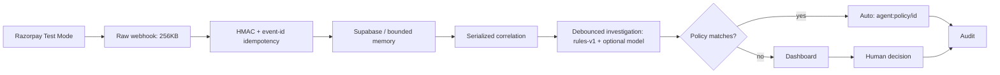

# PayScope

[](https://www.typescriptlang.org/) [](https://react.dev/) [](https://razorpay.com/) [](https://supabase.com/) [](https://nodejs.org/)

Evidence-first **payment operations** for Razorpay — verify every webhook, turn risk into reviewable incidents, investigate with bounded AI, and let admin policies auto-handle the safe stuff. **No route ever captures a payment, issues a refund, changes a subscription, or contacts a customer.**

Single repo: `backend/` (API) + `frontend/` (dashboard) → deploy `frontend/` on Vercel, `backend/` as standalone Node or Vercel serverless. Full plan: [`Plan.md`](./Plan.md).

## Why PayScope

Payment webhooks are noisy and untrusted — retried, out-of-order, spoofed. PayScope turns them into **reviewable incidents** with deterministic evidence, so you (or a threshold policy) can decide safely without touching money.

## Architecture



**Stack:** Node 22 + Express + TypeScript strict · `crypto` HMAC-SHA256 · Supabase Postgres (service-role only, in-memory fallback) · `rules-v1` + optional OpenAI structured output · Zod, rate buckets (90/min), concurrency caps (12 API / 24 webhooks)

## What it does

- **HMAC ingestion** — `POST /webhooks/razorpay` needs `X-Razorpay-Signature` over raw body (401 if missing, 503 if secret missing).
- **Idempotency** — `x-razorpay-event-id` dedup + 30s in-flight expiry; duplicate repairs correlation.
- **Events** — `payment.failed/.authorized/.captured`, `order.paid`, `refund.created/.failed`, `payment.dispute.created`, `subscription.pending/.halted/.cancelled`; unknown → `unknown.event` (audit only).
- **Correlation** — payment/order/subscription exact match, else 15-min customer+method window; conflicting currencies never grouped; `captured`/`order.paid` only resolves if timestamp ≥ risk and amount covers it (partial → `monitoring`, full → `recovered`).
- **Bounded** — 2k events, 500 incidents, 100 refs/incident, 30 evidence, 50 audits/incident, sliding 300ms debounce (101 burst → 1 incident).
- **Policies** — admin `auto_policies` (`incidentTypes`, `severities`, `minConfidence`, `maxAmountPaise`, `action`, `requireHumanForEscalate`). First enabled match auto-executes `monitor`/`prepare_follow_up`/`review` as `agent:policy/<id>`; `dismiss` ≤₹1000 low/medium only, `escalate` never auto unless allowed. 50 cap, Supabase or memory.
- **History import** — `POST /api/payment-ops/import-history` pulls `GET /v1/payments` (`from/to/count/skip`, 5×100, 10s, 1MB cap) via `history:<id>:<type>`.
- **Dashboard** — `loaded-window` metrics (not all-time), `Needs attention` / `All` queue, incident detail (12-line timeline, evidence, bounded investigation, `Re-run`/`Approve`/`Dismiss`, `agent:policy/<id>` audit), connection panel (webhook copy + import), policy panel, verified event stream. All payloads runtime-validated.

## API

| Method | Route | Purpose | Auth |
| --- | --- | --- | --- |
| `POST` | `/webhooks/razorpay` | Ingest verified webhook | HMAC |
| `GET` | `/health` | `ok` + `databaseConfigured` | none |
| `GET` | `/api/payment-ops/dashboard` | Metrics + recent + attention | Bearer |
| `GET` | `/api/payment-ops/connection` | Health (no secrets) | Bearer |
| `GET` | `/api/payment-ops/events` | Latest 200 summaries | Bearer |
| `GET` | `/api/payment-ops/incidents` | List (filter `status`) | Bearer |
| `GET` | `/api/payment-ops/incidents/:id` | Detail + events + audit | Bearer |
| `POST` | `/api/payment-ops/incidents/:id/investigate` | Re-run investigation | Bearer |
| `POST` | `/api/payment-ops/incidents/:id/actions` | Record human decision | Bearer |
| `POST` | `/api/payment-ops/import-history` | Import history | Bearer |
| `GET/POST/DELETE` | `/api/payment-ops/policies` | List / upsert / delete policies | Bearer |

`Bearer <API_ACCESS_TOKEN>` required outside `development` (`REQUIRE_API_AUTH=true`). `GET /api/*` 90/min, webhooks 600/min.

## Quick start — single repo

```bash
# backend
cd backend
cp .env.example .env   # fill below
npm install
npm run build
npm start              # http://localhost:25655

# frontend (new terminal)
cd ../frontend
cp .env.example .env
npm install
npm run dev            # http://localhost:3000 → proxies /api to :25655
```

Migrations (Supabase SQL editor, before setting `SUPABASE_*`):

```bash
backend/supabase/migrations/20260820_paymentops_sentinel.sql
backend/supabase/migrations/20260821_auto_policies.sql
```

Without `SUPABASE_*` the API runs in bounded memory (Test Mode only).

## Env — backend

| Var | Required | Notes |
| --- | --- | --- |
| `PORT` | no | `25655` |
| `NODE_ENV` | no | `development` skips Bearer unless `REQUIRE_API_AUTH=true` |
| `RAZORPAY_ENVIRONMENT` | no | `test` / `live` (`live` needs `SUPABASE_*`+`RAZORPAY_WEBHOOK_SECRET`) |
| `API_ACCESS_TOKEN` | prod | Bearer + `CORS_ORIGINS` |
| `CORS_ORIGINS` | prod | `https://domain.vercel.app` |
| `PAYMENT_OPS_PUBLIC_URL` | no | `https://your-api.vercel.app` for webhook URL |
| `RAZORPAY_KEY_ID/SECRET` | import | `rzp_test_*` |
| `RAZORPAY_WEBHOOK_SECRET` | webhooks | 32+ chars |
| `SUPABASE_URL/KEY` | prod | service-role, never frontend |
| `OPENAI_API_KEY` | no | `model` investigations, else `rules-v1` |
| `TRUST_PROXY` | no | `true` behind Nginx/Vercel |

## Env — frontend

```env
VITE_API_BASE_URL=http://localhost:25655
VITE_API_TIMEOUT_MS=20000
VITE_API_ACCESS_TOKEN=
```

`VITE_*` is baked into the bundle — never put `RAZORPAY_*`/`SUPABASE_*`/`OPENAI_*` there. `VITE_API_PROXY_TARGET` optionally overrides `vite.config.ts` proxy.

## Verify — no real credentials needed

```bash
cd backend && npm run test:smoke
```

Isolated API on random port checks: HMAC valid/invalid, duplicate, partial→`monitoring` (300/1000) → `recovered` (700), out-of-order, privacy (raw not leaked), 101-burst, `dismiss` cap, Bearer gate, plus `npm run build` + `npm audit`.

Frontend: `cd frontend && npm run build` must pass with no warnings.

## Safety

- Raw-body HMAC `timingSafeEqual`, `PAYLOAD_TOO_LARGE` 413, replay via `x-razorpay-event-id` + 30s `inFlight`, bounded concurrency.
- `occurredAt` not `receivedAt` for recovery, capped at `amountAtRisk`, `truncated` raw payloads (16KB).
- Atomic `incidents`+`audit_logs`+`agent_runs` via `paymentops_persist_*` RPCs, graceful `clearInterval` + `shutdown()`.

## Limits

`loaded-window` metrics (count + earliest/latest `occurredAt`), not all-time. Single-instance only (`mutationQueue`, `rateBuckets` are process-local).

## Deploy — Vercel single repo

- Push this repo; import `frontend/` as Vercel project root, `backend/` as separate Vercel project or standalone Node. Set `VITE_API_BASE_URL` to `https://your-api.vercel.app` before `vite build`, add Vercel domain to `CORS_ORIGINS`, use HTTPS.

```
payscope/
  backend/   # Express API
  frontend/  # React dashboard
  Plan.md    # source of truth
```

Built for Razorpay Test Mode — where evidence, not clicks, drives payment ops.
