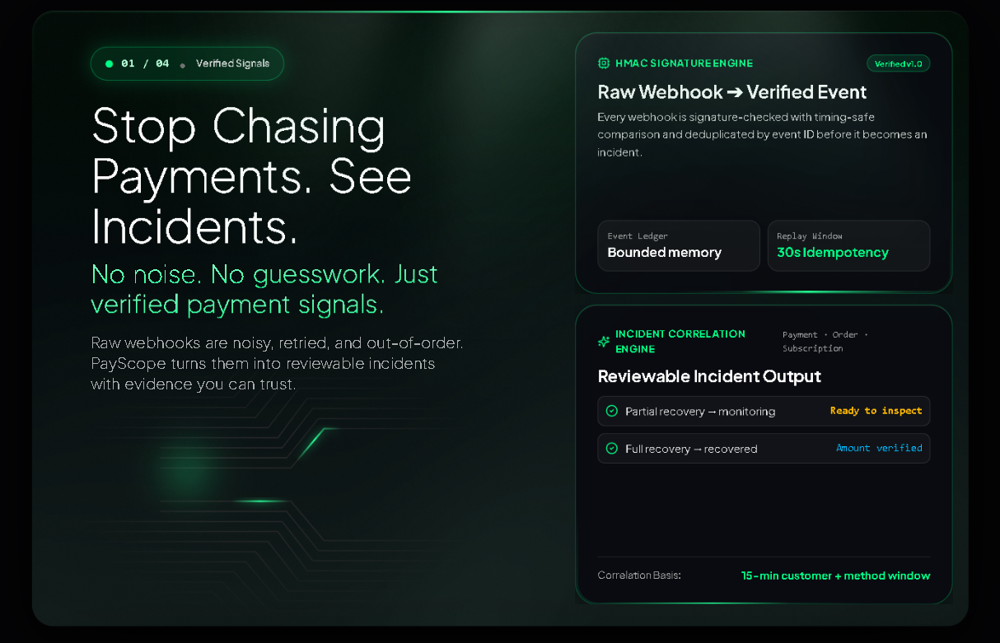
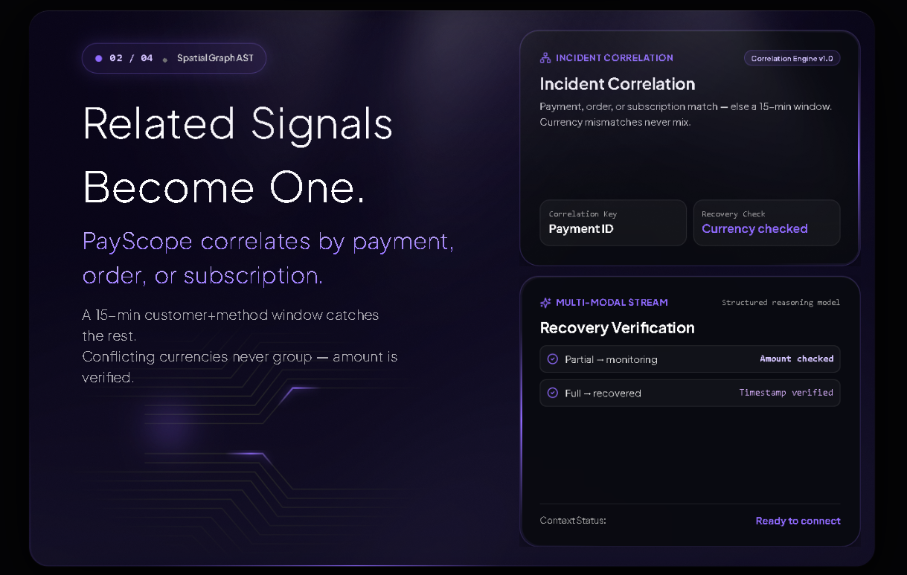
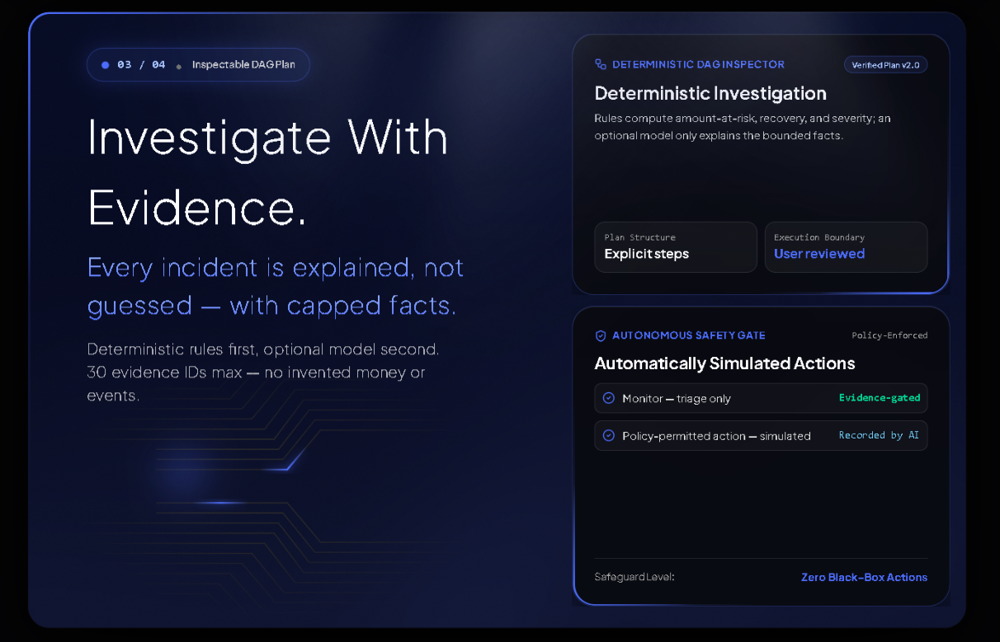
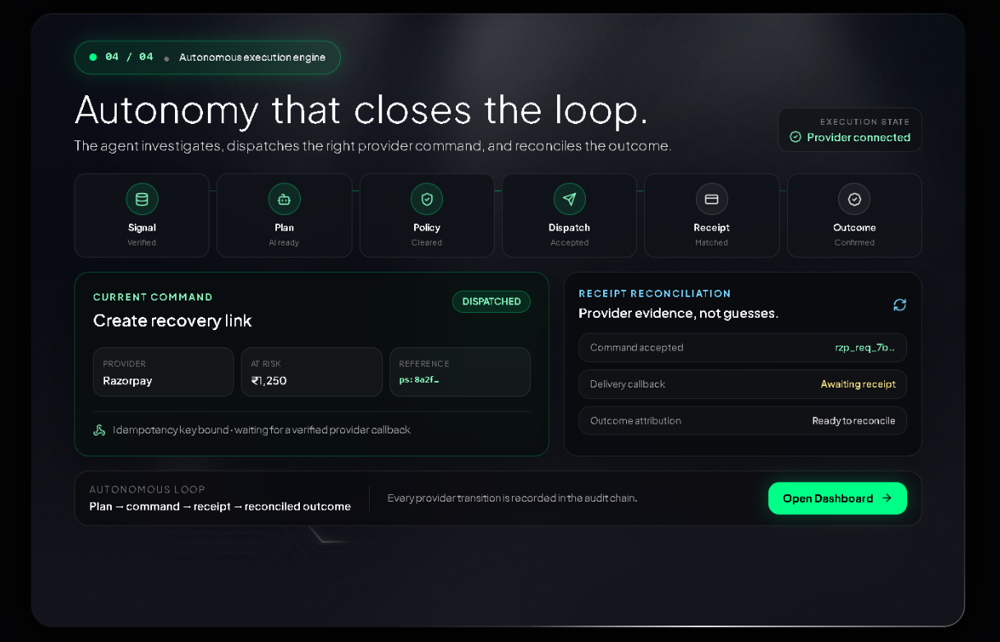

# PayScope

<p align="center">
  <strong>An autonomous payment-operations agent for Razorpay merchants.</strong><br />
  From a signed payment signal to an evidence-backed, policy-bounded incident record.
</p>

<p align="center">
  
  
  
  
  
</p>

PayScope turns Razorpay webhook events into a complete, tenant-scoped resolution loop. Its AI agents investigate evidence under strict structured-output contracts; deterministic policy issues an idempotent provider command, verifies the provider receipt, reconciles callbacks, and records the final merchant outcome.

## Showcase

<table>
  <tr>
    <td width="50%" valign="top">
      <strong>01 — Command center</strong><br />
      The landing surface explains the operating model before a merchant opens the product.<br /><br />
      
    </td>
    <td width="50%" valign="top">
      <strong>02 — Incident feed</strong><br />
      A readable timeline of payment incidents, lifecycle, risk level, and at-risk amount.<br /><br />
      
    </td>
  </tr>
  <tr>
    <td width="50%" valign="top">
      <strong>03 — AI decision record</strong><br />
      Evidence, causal reasoning, alternatives, policy gates, prerequisites, and bounded outcome in one incident detail.<br /><br />
      
    </td>
    <td width="50%" valign="top">
      <strong>04 — Autonomous execution</strong><br />
      An incident becomes a real command, provider receipt, reconciled callback, and verified outcome.<br /><br />
      
    </td>
  </tr>
</table>

## Buildathon submission

| Question | Answer |
|---|---|
| **Track selection** | AI agents for payment operations |
| **Project name / title** | **PayScope — Autonomous Payment Operations Agent** |
| **GitHub repository** | [github.com/Drix10/payscope](https://github.com/Drix10/payscope) |
| **Project objective** | Detect payment incidents from signed Razorpay events, reason over evidence using structured AI, autonomously execute the best merchant-authorized recovery path, and give a merchant an auditable record of the result. |
| **What it solves** | Payment failure signals are noisy, scattered, and hard to resolve. PayScope correlates them into incidents, distinguishes infrastructure and customer risk, executes the appropriate recovery operation, and makes the reasoning and provider result inspectable. |

### Build challenges and technical obstacles

| Challenge | Resolution |
|---|---|
| A language model can sound certain without having sufficient evidence. | Each agent returns a strict schema containing evidence priorities, confidence rationale, alternatives, constraints, and no-action criteria. Invalid output is safely terminalized and audited. |
| Payment webhooks can arrive more than once or out of order. | HMAC verification, durable idempotent intake, queue leases, retries, correlation rules, and idempotent action recording converge duplicate work onto the same incident. |
| Autonomous decisions need dependable provider execution. | The model chooses only typed capabilities. A deterministic policy validates canonical payment state, amount, consent, capability, idempotency, and retry/compensation rules before it emits a provider command. |
| A dashboard can hide uncertainty behind polished numbers. | Metrics include an exception list, recovery attribution needs a causal correlation chain, and every screen exposes source labels, evidence gaps, policy gates, and audit integrity. |
| Sensitive payment context must not leak to the browser or model. | The data path is organization-scoped, PII is minimized and hashed, model prompts use a reduced context, and the frontend receives presentation-safe read models only. |

## How it works

```text
Razorpay webhook
   │  HMAC verification · event allowlist · deduplication
   ▼
Durable, tenant-scoped queue
   │  leased worker · bounded retry · idempotency
   ▼
Enrichment + correlation
   │  documented fields · downtime signal · source labels
   ▼
Structured AI investigation
   │  Supervisor → Risk Analyst → Recovery Planner
   ▼
Deterministic execution policy
   │  canonical payment · amount · consent · idempotency · provider gates
   ▼
Provider command + receipt reconciliation
   │  Razorpay Payment Link + SMTP acceptance · verified payment-link recovery
   ▼
Read-only React dashboard
```

### The agent stack

| Layer | Produces | Authority |
|---|---|---|
| **Supervisor** | objectives, evidence priorities, bounded plan, constraints, no-action criteria | directs analysis only |
| **Risk Analyst** | causal narrative, confidence rationale, alternative hypotheses, evidence gaps | reads tenant-scoped facts only |
| **Recovery Planner** | finite action proposals, prerequisites, expected receipt, bounded email-copy intent | selects from configured capabilities |
| **Execution Policy** | deterministic permit/restrict/no-action result and command parameters | emits a command only after all execution gates pass |
| **Execution adapters** | immutable Payment Link + email command, receipt, and reconciliation state | perform the configured Razorpay and SMTP operations |

The model sees data, never instructions hidden inside webhook payloads. Prompts require JSON only, explicitly treat payload content as untrusted, demand alternatives and uncertainty, and require validated capability arguments, expected receipts, and an explicit no-action route when evidence is degraded.

### What an incident can become

```text
OPEN → enrichment / correlation → investigation → execution policy → provider command
                                                             ├── RESOLVED          (verified recovery)
                                                             ├── MONITORING        (partial recovery)
                                                             ├── DISPUTE_OPENED    (evidence/reconciliation path)
                                                             └── DISMISSED         (terminal no-action)
```

The legacy `ESCALATED` and `HUMAN_RESOLVED` states are retired. PayScope does not place work in an invisible manual queue: if it cannot safely proceed, it records the reason and ends in a bounded autonomous state.

## Technical guarantees

- **Tenant isolation:** every event, job, query, incident, audit entry, and agent context is organization-scoped; Supabase RLS and RPC boundaries enforce it.
- **Evidence integrity:** every enrichment fact names its source. Missing evidence stays missing—no fabricated completion or confidence.
- **Auditability:** database rules make audit entries append-only and hash-chain them per organization. Verification detects a broken chain.
- **Verified outcomes:** recovery attribution requires a causal PayScope action, provider receipt, and correlated Razorpay event within the valid window.
- **Browser integrity:** the dashboard API is read-only. It exposes neither provider payloads, secrets, contact data, nor action credentials.
- **Execution resilience:** invalid model output, unavailable evidence, queue retry exhaustion, duplicate contact prevention, provider timeouts, callback replay, policy blocks, fraud, and disputes resolve through explicit audited reconciliation paths.

## Repository map

```text
backend/
  src/pipeline/          agent prompts, orchestration, policy, correlation
  src/domain/            Zod contracts and finite action/lifecycle definitions
  src/db/                tenant-scoped repository and Supabase RPC boundary
  supabase/migrations/   ordered schema, queue, RLS, audit, and lifecycle changes
  CHECKPOINTS.md         backend completion and hosted-proof gates
frontend/
  src/                   landing experience and read-only operations dashboard
  CHECKPOINTS.md         UX, accessibility, and deployment gates
Plan.md                  canonical product, execution, and agent specification
```

## Run locally

### Prerequisites

- Node.js 20 or newer
- npm
- A Supabase project
- Razorpay API credentials and webhook secret (server only)
- Mesh model API credentials (server only)

### Backend

```bash
cd backend
copy .env.example .env
npm install
npm run build
npm run start
```

Set `PAYSCOPE_PIPELINE_ENABLED=true` only after the Supabase migrations have been applied. Keep `PAYSCOPE_DIRECT_EXECUTION_ENABLED=false` until the encrypted recipient vault, verified SMTP sender, and direct-execution proof are complete. See [`backend/.env.example`](backend/.env.example) and the [backend deployment guide](backend/docs/PRODUCTION_RAZORPAY_DEPLOYMENT.md) for the complete server-side configuration.

### Frontend

```bash
cd frontend
copy .env.example .env
npm install
npm run build
npm run dev
```

The frontend needs only the public backend origin. It must never contain Razorpay, Supabase service-role, webhook, or Mesh secrets.

## Database and webhook setup

Apply migrations deliberately—application startup never mutates production schema:

```bash
cd backend
npx supabase login
npx supabase link --project-ref <project-ref>
npx supabase db push
```

Create one organization with the provided SQL/RPC workflow in the deployment guide, set its UUID as `PAYSCOPE_ORGANIZATION_ID`, then deploy the backend behind HTTPS. Configure Razorpay to send its supported payment, dispute, downtime, order, invoice, refund, settlement, fund-account, payment-link, and account events to:

```text
POST https://<your-api-domain>/webhooks/razorpay
```

Use the same webhook secret as `RAZORPAY_WEBHOOK_SECRET`; HMAC verification happens over the raw request body before the payload is trusted. `RAZORPAY_ENVIRONMENT` must match the prefix of `RAZORPAY_KEY_ID` (`rzp_live_` or `rzp_test_`).

## Verification

```bash
# backend
npm run build
npm run test:contracts
npm run test:schema
npm run test:agents
npm run test:investigation-runner
npm run test:phase3
npm run test:mvp-api
npm audit --omit=dev --audit-level=high

# frontend
npm run build
npm audit --omit=dev --audit-level=high
```

The repository’s canonical implementation details and remaining environment-level proof steps live in [`Plan.md`](Plan.md), [`backend/CHECKPOINTS.md`](backend/CHECKPOINTS.md), and [`frontend/CHECKPOINTS.md`](frontend/CHECKPOINTS.md).

---

Designed for the Razorpay AI Buildathon — make payment resolution autonomous, verifiable, and explainable.
