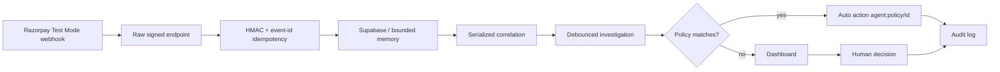

# PayScope API

[](https://www.typescriptlang.org/) [](https://razorpay.com/) [](https://supabase.com/) [](https://nodejs.org/)

Evidence-first payment operations API for Razorpay merchants. Verifies every webhook with HMAC, preserves a bounded event ledger, correlates risk into incidents, runs a bounded investigation (rules + optional structured LLM), and records a policy-gated human or auto-approved outcome. **No route ever captures a payment, issues a refund, changes a subscription, sends an email, or contacts a customer.**

> **Frontend:** [`frontend/`](../frontend) — operator dashboard. Single repo for Vercel. Legacy Intent Canvas is in separate repos. Full plan: [`Plan.md`](../Plan.md).

## Why this exists

Payment webhooks are noisy, out-of-order, retried, and sometimes spoofed. PayScope turns them into **reviewable incidents** with deterministic evidence, so an operator (or a threshold policy) can decide safely without touching money flows.

## Architecture



## Tech stack

- **Runtime:** Node 22, Express 4, TypeScript strict
- **Verification:** `crypto` HMAC-SHA256 + `timingSafeEqual`, raw `express.raw` body
- **Persistence:** Supabase Postgres (service-role only) + bounded in-memory fallback for local Test Mode
- **Investigation:** deterministic `rules-v1` + optional OpenAI structured-output (`responses` API, JSON schema, 15s timeout)
- **Safety:** Zod-friendly `AppError`, rate buckets, concurrency caps, atomic RPC writes

## Features

- **HMAC-verified ingestion** — `POST /webhooks/razorpay` requires `X-Razorpay-Signature` over the *raw* body; missing/invalid → 401, missing secret → 503.
- **Idempotency** — deduplicated on `x-razorpay-event-id`; duplicate delivery repairs missing correlation; in-flight dedup with 30s expiry.
- **Event scope** — `payment.failed`, `payment.authorized`, `payment.captured`, `order.paid`, `refund.created`, `refund.failed`, `payment.dispute.created`, `subscription.pending`, `subscription.halted`, `subscription.cancelled`. Unknown types are retained as `unknown.event` for audit but never create incidents.
- **Correlation** — payment / order / subscription ID exact match, else 15-min customer+method window; conflicting currencies never grouped; recovery (`captured`/`order.paid`) only resolves if timestamp ≥ risk and amount supports it (partial → `monitoring`, full → `recovered`).
- **Serialized state** — `mutationQueue` serializes incident writes; 300ms debounced investigation (sliding) prevents burst from spawning N runs; burst of 101 → 1 incident, 100 refs, 30 evidence, 1 investigation.
- **Bounded memory** — 2,000 events, 500 incidents, 100 refs/incident, 30 facts/evidence, 50 audits/incident, 256KB body, 16KB raw payload, 90 req/min + 600 webhooks/min per IP, 12 concurrent API + 24 webhooks.
- **Autonomy policies** — admin-configurable thresholds (`incidentTypes`, `severities`, `minConfidence`, `maxAmountPaise`, `action`, `requireHumanForEscalate`). After each investigation the agent evaluates policies in creation order; first match auto-executes `monitor`/`prepare_follow_up`/`review_payment_method` as `agent:policy/<id>` (`auto_<action>_by_policy`). `dismiss` is capped (≤₹1000, low/medium only) and `escalate` never auto unless explicitly allowed. 50-policy cap, Supabase-backed with in-memory fallback.
- **History import** — `POST /api/payment-ops/import-history` pulls `GET /v1/payments` with `from/to/count/skip` (5 batches × 100, 10s timeout, 1MB cap) and re-ingests via `history:<paymentId>:<type>` ids.
- **Privacy** — dashboard/incident APIs return `PaymentOpsEventSummary` only; `rawPayload` is private and never leaves the server.

## API surface

| Method | Route | Purpose | Auth |
| --- | --- | --- | --- |
| `POST` | `/webhooks/razorpay` | Verify and ingest raw webhook | HMAC |
| `GET` | `/health` | `status`, `service`, `databaseConfigured` | none |
| `GET` | `/api/payment-ops/dashboard` | Loaded-window metrics, recent events, attention queue | Bearer |
| `GET` | `/api/payment-ops/connection` | Safe health (no secrets) | Bearer |
| `GET` | `/api/payment-ops/events` | Latest 200 summaries | Bearer |
| `GET` | `/api/payment-ops/incidents?status=` | List (filter `needs_review`/`monitoring`/…) | Bearer |
| `GET` | `/api/payment-ops/incidents/:id` | Incident + retained events + audit | Bearer |
| `POST` | `/api/payment-ops/incidents/:id/investigate` | Re-run bounded investigation | Bearer |
| `POST` | `/api/payment-ops/incidents/:id/actions` | Record human decision | Bearer |
| `POST` | `/api/payment-ops/import-history` | Import Razorpay payment history | Bearer |
| `GET` | `/api/payment-ops/policies` | List autonomy policies | Bearer |
| `POST` | `/api/payment-ops/policies` | Create/update policy | Bearer |
| `DELETE` | `/api/payment-ops/policies/:id` | Remove policy | Bearer |

`GET /api/*` is rate-limited (90/min) and concurrency-capped (12); webhooks 600/min, 24 concurrent. `Authorization: Bearer <API_ACCESS_TOKEN>` required outside `development` (or when `REQUIRE_API_AUTH=true`).

## Quick start (30s)

```bash
npm install
cp .env.example .env   # fill values below
npm run build
npm start              # http://localhost:25655
```

Apply migrations before setting `SUPABASE_*`:

```bash
# in Supabase SQL editor
backend/supabase/migrations/20260820_paymentops_sentinel.sql
backend/supabase/migrations/20260821_auto_policies.sql
```

Without `SUPABASE_URL`/`SUPABASE_SERVICE_ROLE_KEY` the API runs in bounded memory (Test Mode only, data lost on restart).

## Environment

| Var | Required | Notes |
| --- | --- | --- |
| `PORT` | no | default `25655`, 1–65535 |
| `NODE_ENV` | no | `development` skips Bearer unless `REQUIRE_API_AUTH=true` |
| `RAZORPAY_ENVIRONMENT` | no | `test` (default) or `live`; `live` requires `SUPABASE_*` + `RAZORPAY_WEBHOOK_SECRET` |
| `API_ACCESS_TOKEN` | prod | Bearer for `/api/*`; also `CORS_ORIGINS` required outside dev |
| `CORS_ORIGINS` | prod | comma-separated exact origins, e.g. `https://app.example.com` |
| `PAYMENT_OPS_PUBLIC_URL` | no | public https origin for `GET /connection` webhook URL; `http://localhost` allowed only in dev |
| `RAZORPAY_KEY_ID` / `RAZORPAY_KEY_SECRET` | for import | Test Mode `rzp_test_*` only in this repo |
| `RAZORPAY_WEBHOOK_SECRET` | webhooks | 32+ random chars, used for HMAC |
| `SUPABASE_URL` | prod/live | `https://*.supabase.co` |
| `SUPABASE_SERVICE_ROLE_KEY` | prod/live | server-only, never in frontend |
| `OPENAI_API_KEY` | no | enables structured `model` investigations; without it `rules-v1` is used and labelled |
| `OPENAI_MODEL` | no | default `gpt-4.1-mini` |
| `TRUST_PROXY` | no | `true` when behind Nginx so `req.ip` is real client IP for rate limiting |

All Razorpay/Supabase/OpenAI secrets are server-only. Never use `VITE_*`.

## Verification

No real credentials needed:

```bash
npm run test:smoke
```

Spawns an isolated API on a random port and checks: valid/invalid HMAC, duplicate idempotency, partial (300/1000 → `monitoring`) and full (700 → `recovered`) recovery, out-of-order success before failure, raw payload privacy, deleted demo route 404, 101-event burst → 1 incident / 100 refs / 30 evidence / 1 investigation (sliding 300ms debounce), spoofed operator ignored, `live` missing secrets fail-fast, Bearer token gate (missing → 401, `x-paymentops-key` legacy → 401, valid → 200), and policy `dismiss` cap. Also: `npm run build` and `npm audit --omit=dev --audit-level=high` (0 high).

For autonomy, the smoke-adjacent manual check sends a `payment.failed 800paise` (low, 0.86 confidence) and asserts `operator: agent:policy/pol_auto_monitor_low`.

## Investigation boundary

Rules compute facts (grouping, amount-at-risk, recovery, severity). Optional model receives only bounded facts `{incident, events[]}` and must return JSON matching a strict schema (`incidentSummary` 700, `observedPattern` 900, `evidenceEventIds` subset of facts, `requiresHumanApproval: true`). Every money value is server-calculated; evidence IDs are validated. Without `OPENAI_API_KEY`, the run is `rules-v1` with 0.86 confidence (0.72 on model error).

## Safety controls

- Raw-body HMAC with `timingSafeEqual`; `entity.too.large` → 413, `entity.parse.failed` → 400.
- Replay protection via `x-razorpay-event-id` + `inFlightEvents` dedup (30s expiry) and bounded webhook concurrency.
- Out-of-order handling via provider `occurredAt` (not `receivedAt`); recovery capped at `amountAtRisk`.
- Private raw payloads (16KB cap, `truncated` marker).
- Atomic `incidents` + `audit_logs` (+ `agent_runs`) via `paymentops_persist_*` RPCs.
- Graceful shutdown: `clearInterval(cleanupRateBuckets)` + `PaymentOpsService.shutdown()` clears all 300ms timers.

## Operational limits

- Dashboard reports **loaded event window** (count + earliest/latest `occurredAt`), not all-time revenue. Use Supabase for durable history.
- Single-instance only: `mutationQueue`, `inFlight*`, `rateBuckets` are process-local. Scale only after a durable queue + shared idempotency store.
- See `docs/PRODUCTION_RAZORPAY_DEPLOYMENT.md` for Nginx (127.0.0.1:25655, 80/443), `PAYMENT_OPS_PUBLIC_URL`, and live-mode blockers (org scoping, queue, alerting, threat model).

## Project layout

```
src/
  server.ts                         # Express, CORS, rate limits, auth, routes, shutdown
  services/paymentOpsService.ts     # normalize, correlate, investigate, policies, import
  services/paymentOpsRepository.ts  # Supabase adapter + validation
  services/paymentOpsTypes.ts       # shared types
supabase/migrations/                # 20260820_* (4 tables + 2 RPCs), 20260821_* (policies)
scripts/smoke-test.js               # isolated regression
```

## Production checklist (before multi-tenant)

1. Apply both migrations, set server-only `SUPABASE_*`, unique `RAZORPAY_WEBHOOK_SECRET`, `PAYMENT_OPS_PUBLIC_URL=https://...`, `CORS_ORIGINS`, `API_ACCESS_TOKEN`, `REQUIRE_API_AUTH=true`.
2. Add auth + `organization_id` + RLS before browser-direct DB access.
3. Replace in-process queue with durable queue before horizontal scaling.
