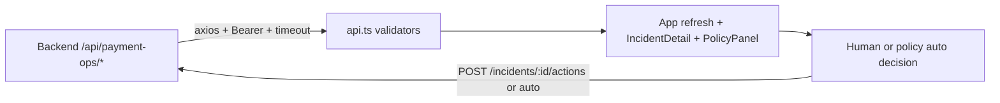

# PayScope Dashboard

[](https://react.dev/) [](https://www.typescriptlang.org/) [](https://vitejs.dev/) [](https://razorpay.com/)

Operator command center for PayScope. Shows verified Razorpay incidents, evidence-bound investigations, and policy-driven outcomes — no checkout, no financial execution, no secrets in the browser.

> **API:** [`backend/`](../backend) — webhook verification, correlation, investigation, policies. Full plan: [`Plan.md`](../Plan.md).

## Why this dashboard

- **Know what happened** — every card comes from `GET /api/payment-ops/*` and is runtime-validated; no invented money or events.
- **See what the agent did** — provider (`rules-v1`/`model`), confidence, evidence IDs (subset of incident), observed pattern, and `requiresHumanApproval` are all bounded and auditable.
- **Keep control** — human approval by default; admin policies can auto-execute only `monitor`/`prepare_follow_up`/`review` within thresholds (`dismiss` capped ≤₹1000, `escalate` never auto unless explicitly allowed). Every auto appears as `agent:policy/<id>` in the audit trail.

## Screens

| Area | What you see |
| --- | --- |
| **Operations overview** | Captured in loaded window, amount at risk (net of recovery), recovered, open incidents, last signal — all labelled as *loaded window*, not all-time. |
| **Incident queue** | `Needs attention` (needs_review/monitoring/escalated) vs `All incidents`; severity (critical/high/medium/low) + status pills; tap to inspect. |
| **Incident detail** | At-risk/recovered/verified count/status, newest 12 of N timeline (hidden count noted), evidence + missing context, bounded investigation, recommended next step, `Re-run` + `Approve …` / `Dismiss`, and a newest-first `Audit trail` (`system`/`agent`/`operator` or `agent:policy/<id>`). |
| **Razorpay connection** | Webhook signature / history import / durable storage readiness, webhook endpoint copy, `PAYMENT_OPS_PUBLIC_URL` guidance, and bounded history import (days + `Continue` pagination). |
| **Autonomy policies** | List with `On`/`Off` + `Delete`, per-policy type/severity/confidence/amount/action, `escalate` human-gate notice, and a `New policy` form (action, confidence, max ₹, incident types, severities). |
| **Verified event stream** | Latest 7 of 12 recent events (`verified`/`import`, customer · relative time). |

All layouts are checked at 1280px and 390px with no horizontal overflow.

## Tech stack

- **React 18 + TypeScript strict + Vite 6** — `src/api.ts` runtime validators for every payload (`isDashboard`, `isIncident`, `isIncidentDetail`, `isAutoPolicy`, …), `maxContentLength` 300k, abortable fetches.
- **Tailwind CSS 4 + lucide-react** — dark, high-contrast, `overflow-x-hidden` root.
- **Axios** — `VITE_API_BASE_URL` + `VITE_API_ACCESS_TOKEN` (temporary browser gate, not a secret) + `VITE_API_TIMEOUT_MS`.

## Quick start

```bash
npm install
cp .env.example .env
# edit .env (see below)
npm run dev     # http://localhost:3000 → proxies /api to http://localhost:25655
```

Production:

```bash
npm run build   # → dist/
```

## Configuration

`.env.example`:

```env
VITE_API_BASE_URL=http://localhost:25655
VITE_API_TIMEOUT_MS=20000
VITE_API_ACCESS_TOKEN=
```

| Var | Notes |
| --- | --- |
| `VITE_API_BASE_URL` | API origin; empty → same-origin (`/api/*` proxied via `vite.config.ts` → `VITE_API_PROXY_TARGET` or `http://localhost:25655`). No trailing slash needed. |
| `VITE_API_TIMEOUT_MS` | 1s–120s, default 20000. `ECONNABORTED` → “timed out, try again”. |
| `VITE_API_ACCESS_TOKEN` | Temporary `Bearer` for `/api/*`. **Not a secret** — Vite bakes `VITE_*` into the bundle. Replace with real sessions before multi-tenant. |

Never put `RAZORPAY_*`, `SUPABASE_SERVICE_ROLE_KEY`, or `OPENAI_API_KEY` in `VITE_*`.

`vite.config.ts` also supports `VITE_API_PROXY_TARGET` for `server.proxy['/api']`.

## Data flow & safety



- **Validation first** — `refresh()` only sets state if `isDashboard`/`isConnectionStatus`/`isIncident` pass; `openIncident` only if `isIncidentDetail` passes (checks `eventIds` subset of `incident`, `evidenceEventIds` subset, audit actor allowlist).
- **Abortable** — `refreshController` + `detailController` abort on new request and on unmount; interval polling (30s) and `visibilitychange` use background refresh (`loading` not flickered).
- **No secret leakage** — only `PaymentOpsEventSummary` (no `rawPayload`) ever reaches the browser.
- **Autonomy UI** — `PolicyPanel` shows `active/total`, `On/Off` (POST with flipped `enabled`), `Delete`, and `Create` (validates `dismiss` cap client-side; server re-validates 422). New policies appear immediately; audit trail shows `agent:policy/<id>` for autos.

## Verification

```bash
npm run build
```

Must pass with no console warnings. Runtime checks to try manually: empty account (queue shows “No incidents”), unsigned webhook (ignored), duplicate `x-razorpay-event-id` (marked `duplicate: true`), slow network (timeout → retry), 390px width (no overflow), toggle a policy `On` → `Off` → low-risk incident stays `needs_review` instead of auto-`monitoring`.

The dashboard **never invents** payment data — it renders only `success: true` + validated `data`.

## Deployment

- `npm run build` + serve `dist/` via same origin as `CORS_ORIGINS` or set `VITE_API_BASE_URL=https://api.yourdomain.com`.
- Backend `PAYMENT_OPS_PUBLIC_URL` must be the public `https://…` that Razorpay calls at `https://…/webhooks/razorpay`.
- Add real auth (sessions, org scoping) before public multi-tenant — the current `VITE_API_ACCESS_TOKEN` is a single-tenant gate.

## Project layout

```
src/
  App.tsx                           # refresh, openIncident, investigate, act, importHistory, policies
  api.ts                            # axios instance + isDashboard/isIncident/isAutoPolicy + getApiErrorMessage
  config.ts                         # APP_CONFIG (baseUrl/token/timeout)
  types/paymentOps.ts               # shared frontend types (incl. AutoPolicy)
  components/paymentops/
    IncidentList.tsx                # queue + Needs attention / All
    IncidentDetail.tsx              # timeline (12) + investigation + actions + audit
    ConnectionPanel.tsx             # health + webhook copy + import
    PolicyPanel.tsx                 # autonomy policies CRUD
    MetricCard.tsx                  # loaded-window metrics
```

`CHECKPOINTS.md` is the release checklist; `docs/DEPLOYMENT.md` has the Nginx + env details.
